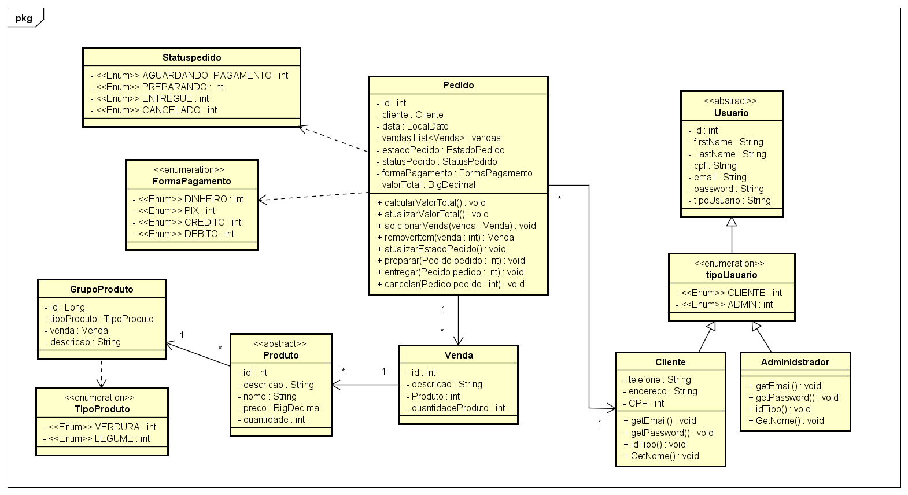
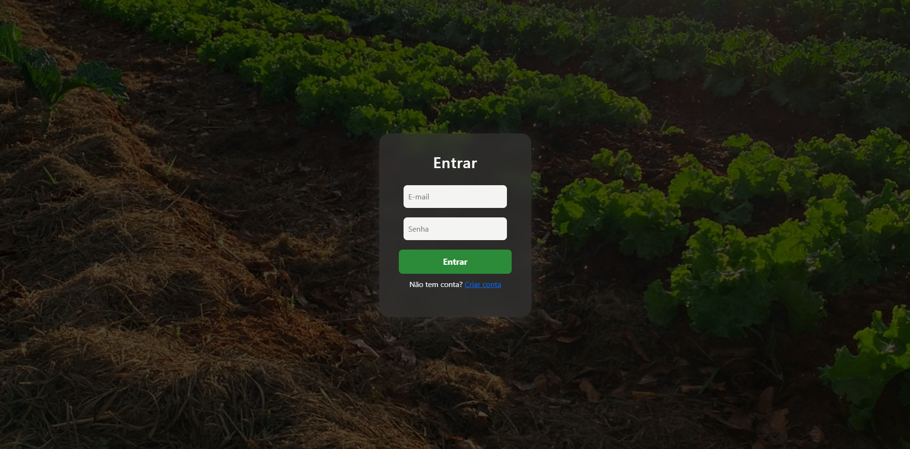
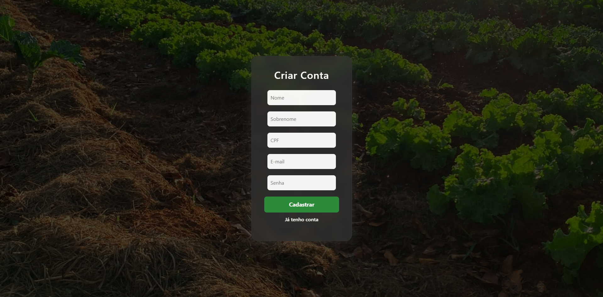
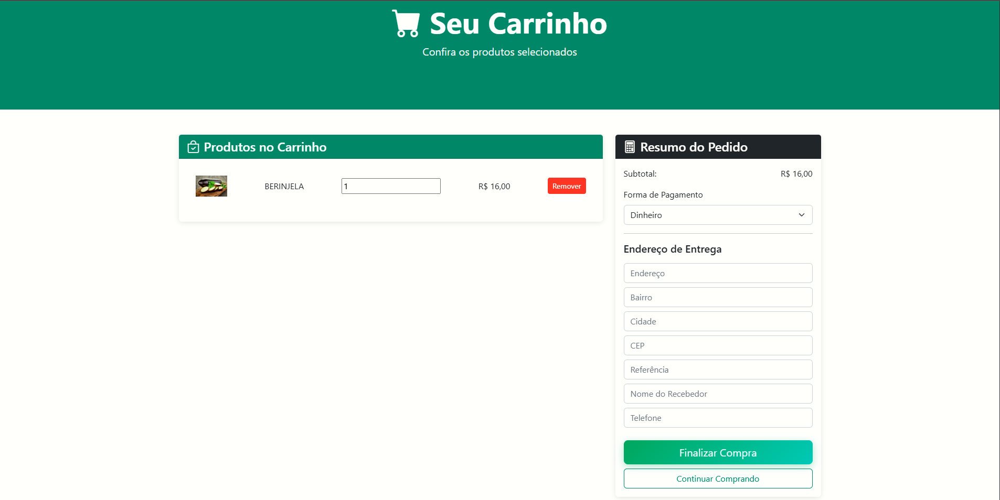

# 🌱 HORTA DELIVERY – Sistema Completo (Back-end + Front-end)

Bem-vindo ao Horta Delivery, um sistema completo de e-commerce de hortaliças com:

✔ Back-end em Spring Boot + JWT
✔ Front-end em HTML/CSS/JS
✔ Autenticação, listagem de produtos, carrinho e pedidos
✔ Integração total via Fetch API

# Diagrama de classe

## 📸 IMAGENS DO PROJETO

## Tela de login

## Tela de criar conta

## Cards de produtos carregados da API

## Tela de carrinho

## Tela de gerenciamento de pedidos

## Tela de gerenciamento de Produto

## Tela de novo produto

## Tela de gerenciamento de usuarios

## Tela de criar novo usuario

## Tela de sobre

## Login no Postman

## Listagem de produtos

## Listagem de pedidos

## 🛠 Tecnologias Utilizadas
🔵 Back-end

Java 17+

Spring Boot 3

Spring Security + JWT

Spring Data JPA

H2 Database / MySQL

Lombok

🟢 Front-end

HTML5

CSS3 + Bootstrap 5

JavaScript (ES Modules)

Fetch API

LocalStorage para JWT

## 🔐 Autenticação — JWT
🔸 Endpoint de Login:

POST http://localhost:8080/auth/login

### Body: 
{
  "username": "gui@gmail.com",
  "password": "123"
}

### Resposta:
 {
  "token": "eyJh..."
}

### Token salvo no front:

localStorage.setItem("jwtToken", token);

# 🥬 Endpoints – Produto

| Método | Rota            | Função             |
| ------ | --------------- | ------------------ |
| GET    | `/produto`      | Lista produtos     |
| GET    | `/produto/{id}` | Retorna um produto |
| POST   | `/produto`      | Cria produto       |
| PUT    | `/produto/{id}` | Edita produto      |
| DELETE | `/produto/{id}` | Exclui produto     |

# 🛒 Endpoints – Pedido
### 🔸 Fluxo completo do pedido:

Criar pedido

Preparar

Entregar

Cancelar

## 📑 Endpoints:

| Método | Rota                    | Descrição            |
| ------ | ----------------------- | -------------------- |
| GET    | `/pedido`               | Lista todos          |
| GET    | `/pedido/{id}`          | Detalhes             |
| POST   | `/pedido`               | Cria                 |
| PUT    | `/pedido/{id}`          | Atualiza             |
| DELETE | `/pedido/{id}`          | Exclui               |
| PUT    | `/pedido/{id}/preparar` | Muda para PREPARANDO |
| PUT    | `/pedido/{id}/entregar` | Muda para ENTREGUE   |
| PUT    | `/pedido/{id}/cancelar` | Muda para CANCELADO  |

# 🌐 Integração Front-end → Back-end

### Exemplo de consumo da API /produto:

# 🧪 Testes no Postman

Checklist:

✔ Login (gera token)
✔ GET /produto
✔ POST /pedido
✔ PUT /pedido/{id}/preparar
✔ PUT /pedido/{id}/entregar

# ▶ Como Rodar o Projeto
🚀 Back-end 

mvn spring-boot:run

Acessar: http://localhost:8080

# 🌐 Front-end 

npx serve

Acessar: http://localhost:3000

🔒 O sistema redireciona automaticamente para login.html se não houver token

# 🔧 Banco de Dados

H2 Console:
http://localhost:8080/h2-console

# ✨ Funcionalidades Implementadas

✔ Login com JWT
✔ Lista produtos do back-end
✔ Carrinho com LocalStorage
✔ Finaliza pedido enviando para API
✔ Fluxo do pedido (preparar, entregar, cancelar)
✔ Proteção de páginas (não entra sem login)
